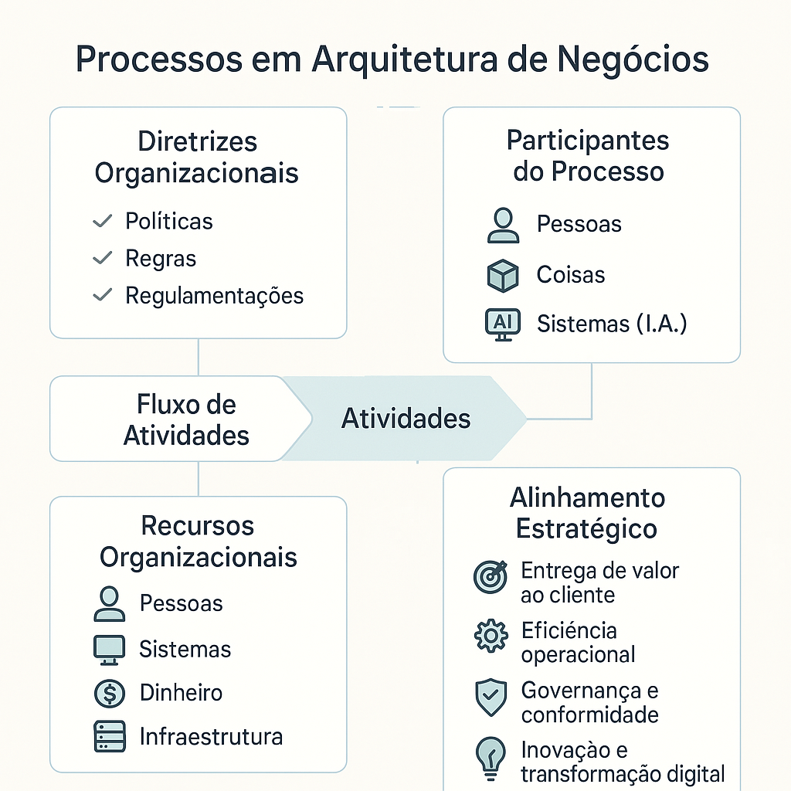

# **Aplicando a Arquitetura de Negócios**

## 📚 Índice

- [O que é Arquitetura de Negócios?](#o-que-é-arquitetura-de-negócio)
- [Quais os principais valores gerados?](#quais-os-principais-valores-gerados)
- [Como elaborar a Arquitetura de Negócios na prática?](#como-elaborar-a-arquitetura-de-negócios-na-prática)
- [Principais Blueprints de Arquitetura de Negócio](#principais-blueprints-de-arquitetura-de-negócio)
- [🔧 Processos em Arquitetura de Negócios](#processos-em-arquitetura-de-negócios)
  - [Diretrizes Organizacionais](#diretrizes-organizacionais)
  - [Recursos Organizacionais](#recursos-organizacionais)
  - [Fluxo de Atividades](#fluxo-de-atividades)
  - [Participantes](#participantes)
  - [Alinhamento Estratégico](#alinhamento-estratégico)
- [🧩 Capacidades de Negócio: Muito além de processos](#capacidades-de-negócio-muito-além-de-processos)
  - [🔑 Características de uma Capacidade](#características-de-uma-capacidade)
  - [🔄 Interoperabilidade e Conectividade](#interoperabilidade-e-conectividade)
  - [🧠 Um sistema, uma coisa](#um-sistema-uma-coisa)
- [Outros Fundamentos Essenciais da Arquitetura de Negócio](#outros-fundamentos-essenciais-da-arquitetura-de-negócio)
  - [Tecnologia é meio, não fim](#tecnologia-é-meio-não-fim)
  - [Visão Holística Integrada](#visão-holística-integrada)
  - [Soluções de negócio com uso de tecnologia](#soluções-de-negócio-com-uso-de-tecnologia)
  - [Preparação para o Legado Digital](#preparação-para-o-legado-digital)
  - [A importância do Ciclo de Vida da Informação](#a-importância-do-ciclo-de-vida-da-informação)
  - [Três Pilares Fundamentais](#três-pilares-fundamentais)
- [Conceitos Chaves / Destaques da Jornada](#conceitos-chaves--destaques-da-jornada)
- [Entrega esperada em projetos de Arquitetura de Negócio](#entrega-esperada-em-projetos-de-arquitetura-de-negócio)

## [**O que é Arquitetura de Negócios?**](https://github.com/fredrdh/adn/blob/main/arquitetura%20de%20neg%C3%B3cios.md)

É a **visão holística e multidimensional** do negócio, descrevendo como uma organização usa suas **competências essenciais** para alcançar seus objetivos estratégicos. Inclui aspectos como:

- Capacidades  
- Entrega de valor ponta-a-ponta (end-to-end value delivery)  
- Estrutura organizacional  
- Relações entre estratégias, produtos, políticas, iniciativas e stakeholders  

O padrão Open Business Architecture (O-BA Standard) considera:

- **Visão e influências externas**  
- **Intenção e prioridades estratégicas**  
- **Estrutura de negócio e contexto operacional**

Esses três domínios – **estratégia**, **estrutura** e **contexto operacional** – são igualmente importantes e interdependentes.

Referências principais: **TOGAF** e **BIZBOK Guide / Open Business Architecture (O-BA Standard)**

---

## **Quais os principais valores gerados?**

A Arquitetura de Negócio gera valor por meio de:

- Alinhamento entre estratégia e operações  
- Fonte única das competências do negócio  
- Simplificação de ambientes complexos  
- Transformação organizacional baseada em maturidade  
- Visibilidade ampliada da jornada de transformação

Relaciona-se com outras arquiteturas: Solução, Dados e Tecnologia

---

## **Como elaborar a Arquitetura de Negócios na prática?**

1. Estruturar a TI para incorporar a Arquitetura de Negócio (ex: modelo IT4IT)  
2. Adotar um modelo de maturidade sustentável (ex: OSIMM)  
3. Utilizar o Value Stream de Implementação  
4. Aplicar os principais Blueprints  

É necessário evoluir a camada **Business View** do OSIMM e trabalhar com as perspectivas **AS IS** e **TO BE**

---

## **Principais Blueprints de Arquitetura de Negócio**

- **Business Model Canvas (Domínio Estratégia):** modelo em uma página que responde “o quê”, “para quem”, “como” e “quanto”  
- **Business Capabilities (Domínio Negócio):** descreve o que o negócio faz, organizadas em capacidades Estratégicas, Core e Suporte  
  - Componente-chave: **Mapa de Calor** (Heat Map) para alinhamento com a estratégia  
- **Value Stream (Domínio Operacional):** sequência ponta-a-ponta de atividades que geram valor incremental para o cliente  
- **Information Map (Domínio Negócio):** conecta entidades de informação às capacidades do negócio

---

## **Processos em Arquitetura de Negócios**

- Diretrizes Organizacionais: Políticas, regras e regulamentações que orientam o funcionamento da empresa.
- Recursos Organizacionais: Pessoas, sistemas, infraestrutura e capital que viabilizam os processos.
- Fluxo de Atividades: Sequência de tarefas que compõem os processos de negócio. 
- Participantes: Agentes humanos, dispositivos e sistemas inteligentes envolvidos na execução.
- Alinhamento Estratégico: Garante que os processos contribuam para a entrega de valor, conformidade e transformação digital.

    

## 🧩 **Capacidades de Negócio: Muito além de processos**
As capacidades de negócio são os verdadeiros habilitadores da entrega de valor. Elas não são apenas processos — são compostas por recursos, pessoas, papéis e sistemas que, juntos, tornam possível a execução de uma competência essencial da organização.

### 🔑 **Características de uma Capacidade**
-Não é um processo isolado, mas sim o que o negócio é capaz de fazer de forma consistente.
- Inclui pelo menos dois papéis:
  - Um papel gerencial, responsável por governança, desempenho e alinhamento estratégico.
  - Um papel operacional, que executa as atividades no dia a dia.
- Requer recursos: humanos, tecnológicos, financeiros e informacionais.
- É suportada por processos, mas não se limita a eles.

### 🔄 **Interoperabilidade e Conectividade**
Para que uma capacidade seja eficaz, ela precisa ser interoperável — ou seja, capaz de se conectar ponta-a-ponta com outras capacidades, processos e sistemas. Isso permite:

- Visualizar todas as conexões do início ao fim (end-to-end)
- Reduzir silos organizacionais
- Aumentar a fluidez da informação e da tomada de decisão

  Capacidade ≠ Processo
  Capacidade = Competência + Papéis + Recursos + Processos + Sistemas

### 🧠 **Um sistema, uma coisa**
Na modelagem de capacidades e soluções, é essencial manter o princípio de clareza e unicidade:

Um sistema deve representar uma coisa — ou seja, uma entidade funcional clara e bem definida.
Evite sistemas que tentam fazer tudo: isso dificulta a interoperabilidade, a governança e a evolução tecnológica.
Prefira arquiteturas modulares, com sistemas especializados, bem integrados por meio de APIs e eventos.

---

## ✅ **Outros Fundamentos Essenciais da Arquitetura de Negócio**

### 🔹 **Tecnologia é meio, não fim**
A verdadeira solução é de *negócio*. A tecnologia é apenas a ferramenta que viabiliza a entrega de valor. O foco deve estar na **inteligência de negócio** que guia as decisões.

### 🔹 Visão Holística Integrada
Conecta **estratégia**, **cultura organizacional** e **arquitetura de soluções** em uma visão única e coerente.

### 🔹 Soluções de negócio com uso de tecnologia
UA tecnologia é usada como meio para entregar uma solução de negócio centrada no cliente, com impacto direto em eficiência, qualidade e valor percebido.

### 🔹 Preparação para o Legado Digital
A Arquitetura de Negócio deve considerar a evolução dos sistemas legados, promovendo sua integração, modernização ou substituição gradual. Isso garante continuidade operacional enquanto se avança na transformação digital.

- Avaliação de riscos e dependências técnicas
- Estratégias de desacoplamento e modularização
- Uso de APIs, microsserviços e camadas de abstração
- Planejamento de transição para plataformas modernas (cloud, low-code, etc.)

### 🔹 A importância do Ciclo de Vida da Informação
A informação é um ativo estratégico. Compreender seu ciclo de vida — da criação à eliminação — é essencial para garantir governança, segurança, valor e conformidade. A Arquitetura de Negócio deve mapear como a informação flui entre capacidades, processos e sistemas, promovendo:

- Qualidade e integridade dos dados
- Aderência a normas regulatórias (LGPD, GDPR, etc.)
- Apoio à tomada de decisão baseada em dados
- Sustentação da transformação digital

### 🔹 Três Pilares Fundamentais
- **Transformação Digital**: renovar processos, cultura e experiências com tecnologia  
- **Inovação Contínua**: diferencial competitivo sustentável. Tratar ela como uma competência fundamental
- **Excelência Operacional**: eficiência, agilidade e qualidade na entrega de valor

## 🌟 Conceitos Chaves / Destaques da Jornada

- **RICEFW (SAP):** Reports, Interfaces, Conversions, Enhancements, Forms and Workflows — materializam a Arquitetura de Negócio nos sistemas como integrações, formulários, automações e relatórios  
- **Soluções > Aplicações:** foco em resolver problemas reais de negócio
- **Retention > Acquisition:** um dos maiores desafios de negócio é a **retenção de clientes**. Isso porque o ciclo de aquisição é longo e caro — envolve prospecção, qualificação de leads e conversão, o que demanda esforço de marketing e vendas. Já reter clientes que já confiam na marca é mais eficiente e estratégico para sustentar o crescimento  

---

## 📌 Entrega esperada em projetos de Arquitetura de Negócio

- Capacidades suportadas por processos
- Caso seja preciso, Regime Especial (instrumento jurídico para alteração de regra temporária)  
- 3 processos por capacidade de negócio  
- 2 atores por capacidade de negócio  
- [BIA – Business Impact Analysis](https://tiagosouza.com/coso-controles-internos-estrutura-framework/)
