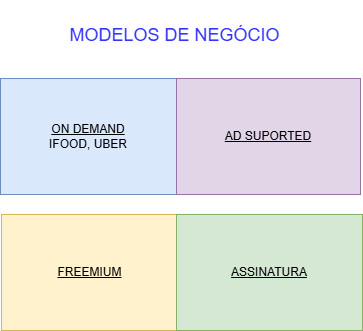

git# Arquitetura de Negócios

A **Arquitetura de Negócios** (ou **Business Architecture**) refere-se à estrutura organizacional, processos, sistemas e tecnologias que suportam os objetivos de negócios de uma empresa. Ela é uma disciplina estratégica que ajuda as organizações a alinhar sua estrutura e processos com suas metas de longo prazo.

>**Arquitetura Corporativa:** é um modelo de referência que tem por objetivo entregar uma estratégia com rentabilidade.

>**Arquitetura de Negócios** é o uso das capacidades da empresa para entregar produtos, serviços e conteúdo.

    

## Índice

- [O que é Arquitetura de Negócios?](#o-que-é-arquitetura-de-negócios)
- [Objetivos da Arquitetura de Negócios](#objetivos-da-arquitetura-de-negócios)
- [Componentes Principais](#componentes-principais)
  - [Estrutura Organizacional](#estrutura-organizacional)
  - [Modelos de Negócio](#modelos-de-negócio)
  - [Modelos de Processo](#modelos-de-processo)
  - [Tecnologias e Infraestrutura](#tecnologias-e-infraestrutura)
- [Benefícios da Arquitetura de Negócios](#benefícios-da-arquitetura-de-negócios)
- [Metodologias Comuns](#metodologias-comuns)
- [Exemplos de Aplicação](#exemplos-de-aplicação)
- [Conclusão](#conclusão)

## O que é Arquitetura de Negócios?

Arquitetura de Negócios é um modelo que descreve como os componentes-chave de uma organização se interconectam para alcançar objetivos estratégicos. Isso inclui a definição de processos de negócios, recursos necessários, estruturas de governança e como as tecnologias são implementadas para suportar esses processos.

Ela atua como uma ponte entre as operações diárias e a estratégia organizacional, proporcionando uma visão holística da organização.

## Objetivos da Arquitetura de Negócios

A principal finalidade da Arquitetura de Negócios é garantir que a estrutura, processos e recursos de uma organização estejam alinhados com seus objetivos estratégicos. Os principais objetivos incluem:

- **Alinhar processos de negócios com a estratégia da empresa.**
- **Melhorar a eficiência operacional e reduzir custos.**
- **Apoiar a transformação digital e a adaptação ao mercado.**
- **Facilitar a inovação e o desenvolvimento de novos produtos ou serviços.**
- **Aumentar a capacidade de adaptação e resposta a mudanças.**

    

## Componentes Principais

### Estrutura Organizacional

A **estrutura organizacional** define como os papéis e responsabilidades são distribuídos dentro de uma empresa. Ela descreve hierarquias, relações entre departamentos e a distribuição de autoridade.

- **Hierarquia funcional:** Como os departamentos e equipes se inter-relacionam.
- **Papéis e responsabilidades:** Como as atividades e funções são divididas e atribuídas aos colaboradores.
- **Governança:** Definição dos processos de tomada de decisão e controle.

    

### Modelos de Negócio

Um **Modelo de Negócio** descreve como uma organização cria, entrega e captura valor. Ele define os principais elementos estratégicos da operação, como segmentos de clientes, canais de distribuição, fontes de receita e estrutura de custos.

A **Arquitetura de Negócios** é responsável por traduzir esse modelo estratégico em uma estrutura operacional real — composta por processos, recursos, capacidades e tecnologias. Em outras palavras:

- O **modelo de negócio** responde à pergunta: *“Como a empresa pretende gerar valor?”*
- A **arquitetura de negócios** responde à pergunta: *“Como a empresa se organiza e opera para colocar isso em prática?”*

#### Exemplos de Interseção

- Se um modelo de negócio se baseia em **assinaturas digitais**, a arquitetura de negócios deve incorporar processos automatizados de cobrança, onboarding de clientes, e suporte contínuo.
- Se a proposta de valor é **atendimento personalizado**, a arquitetura de negócios pode incluir estruturas de CRM, processos de pós-venda e canais de comunicação direta.

#### Ferramentas comuns

- **Business Model Canvas**: ferramenta amplamente usada para modelar negócios de forma visual, que pode servir de insumo para a modelagem da arquitetura.
- **Value Proposition Canvas**: ajuda a detalhar a proposta de valor, que será refletida nos processos e estruturas desenhadas pela arquitetura.

Portanto, a Arquitetura de Negócios **opera como um tradutor** do modelo de negócio — conectando a visão estratégica com a execução organizacional e tecnológica.

    

### Modelos de Processo

A **modelagem de processos** descreve como as operações diárias são realizadas para cumprir os objetivos da organização. Isso inclui:

- **Processos de negócios principais:** Aqueles diretamente ligados à entrega de valor ao cliente (e.g., produção, vendas, atendimento ao cliente).
- **Processos de apoio:** Aqueles que dão suporte às operações principais (e.g., RH, TI, finanças).
- **Fluxos de trabalho e otimização de processos:** Melhoria contínua de como as atividades são executadas.

    

### Tecnologias e Infraestrutura

A **tecnologia e infraestrutura** referem-se às ferramentas, sistemas e plataformas que sustentam os processos de negócios. Isso envolve:

- **Sistemas de informação:** Softwares que automatizam e ajudam no gerenciamento de dados e processos.
- **Infraestrutura de TI:** Redes, servidores e recursos de computação que suportam a operação de tecnologias.
- **Transformação digital:** A adoção de novas tecnologias (como IA, Big Data, etc.) para suportar inovação e mudanças nos processos de negócios.

    

## Benefícios da Arquitetura de Negócios

Uma boa arquitetura de negócios traz diversos benefícios para a organização:

- **Visão clara e integrada:** Ajuda as partes interessadas a compreenderem o funcionamento da organização e como todos os componentes interagem.
- **Redução de custos:** Melhora a eficiência ao otimizar processos e eliminar redundâncias.
- **Aumento da agilidade organizacional:** Facilita a adaptação às mudanças no mercado e nas necessidades do cliente.
- **Melhor tomada de decisões:** Oferece uma visão holística que melhora a capacidade de análise e de decisão estratégica.

## Metodologias Comuns

Existem diversas metodologias para construir e implementar a Arquitetura de Negócios. Algumas das mais conhecidas incluem:

- **TOGAF (The Open Group Architecture Framework):** Um dos frameworks mais usados para arquitetura de TI e negócios, fornece uma abordagem estruturada para a construção de arquiteturas empresariais.
- **Zachman Framework:** Focado em categorizar diferentes aspectos da organização, incluindo objetivos de negócios, funções e tecnologia.
- **Archimate:** Uma linguagem gráfica para modelar a arquitetura corporativa, geralmente usada em conjunto com TOGAF.

## Exemplos de Aplicação

A Arquitetura de Negócios é aplicada de várias formas dependendo da indústria e das necessidades da organização. Alguns exemplos incluem:

- **Transformação Digital:** Empresas que implementam novas tecnologias para melhorar a eficiência e oferecer novos produtos/serviços.
- **Reestruturação Organizacional:** Empresas que precisam reorganizar processos e equipes para melhorar a eficiência operacional.
- **Gestão de Mudanças:** Empresas que estão passando por fusões, aquisições ou mudanças significativas nos modelos de negócios.

## Conclusão

A Arquitetura de Negócios é essencial para alinhar a estratégia de negócios com as operações e sistemas internos de uma organização. Ela permite que as empresas se adaptem com mais facilidade às mudanças do mercado, otimizem seus processos e maximizem a entrega de valor aos seus clientes.

Investir em uma sólida Arquitetura de Negócios não só melhora a eficiência e a comunicação interna, mas também coloca a empresa em uma posição estratégica mais forte para competir no mercado global.